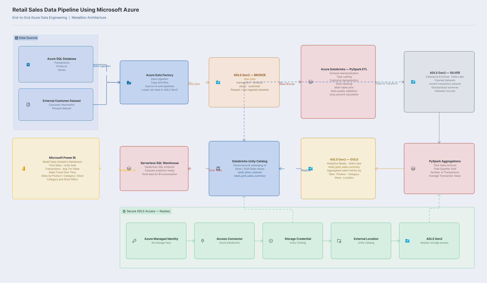
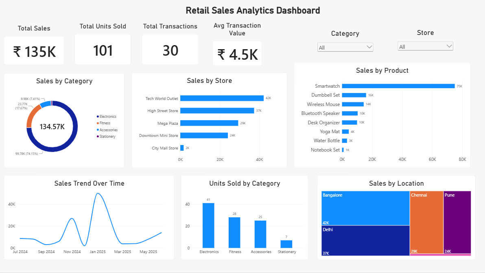

# Retail Sales Data Pipeline | Azure Data Engineering

An end-to-end Azure Data Engineering project that ingests retail data from multiple sources, processes it using the **Medallion Architecture (Bronze → Silver → Gold)**, and serves analytics-ready data to **Power BI**.

The project demonstrates a modern Azure data engineering workflow using **Azure Data Factory, ADLS Gen2, Azure Databricks, PySpark, Delta Lake, Unity Catalog, Databricks SQL Warehouse, and Power BI**.

---

## Architecture



### Data Flow

```text
Azure SQL Database ──────┐
                         ├──> Azure Data Factory
External Customer Data ──┘
                                  │
                                  ▼
                         ADLS Gen2 - Bronze
                                  │
                                  ▼
                       Azure Databricks / PySpark
                                  │
                                  ▼
                         ADLS Gen2 - Silver
                              (Delta Lake)
                                  │
                                  ▼
                         PySpark Aggregations
                                  │
                                  ▼
                          ADLS Gen2 - Gold
                              (Delta Lake)
                                  │
                                  ▼
                            Unity Catalog
                                  │
                                  ▼
                    Databricks Serverless SQL
                                  │
                                  ▼
                               Power BI
```

---

## Project Overview

The objective of this project is to build a simple but complete retail analytics pipeline using Azure.

The pipeline:

- Ingests retail data from **Azure SQL Database and an external customer dataset**
- Uses **Azure Data Factory (ADF)** for ingestion and orchestration
- Stores raw data in the **Bronze layer of ADLS Gen2**
- Uses **Azure Databricks and PySpark** for transformation
- Cleans, validates and joins datasets into the **Silver layer**
- Creates business-level aggregations in the **Gold layer**
- Stores Silver and Gold datasets using **Delta Lake**
- Registers analytics tables using **Unity Catalog**
- Exposes Gold data through a **Databricks Serverless SQL Warehouse**
- Connects the Gold layer to **Power BI** for reporting and visualization

---

## Tech Stack

| Technology | Usage |
|---|---|
| **Azure SQL Database** | Source system for retail data |
| **Azure Data Factory** | Data ingestion and orchestration |
| **Azure Data Lake Storage Gen2** | Bronze, Silver and Gold storage |
| **Azure Databricks** | Distributed data processing |
| **PySpark** | Data cleaning, transformation and aggregation |
| **Delta Lake** | Silver and Gold storage format |
| **Unity Catalog** | Data governance and table registration |
| **Azure Managed Identity** | Keyless ADLS authentication |
| **Databricks SQL Warehouse** | Serving Gold data for BI |
| **Power BI** | Analytics dashboard and visualization |

---

# Medallion Architecture

## Bronze Layer — Raw Data

Azure Data Factory loads source datasets into **ADLS Gen2**.

The Bronze layer contains:

```text
bronze/
├── transaction/
├── product/
├── store/
└── customer/
```

Transaction, product and store data originate from Azure SQL Database, while customer data is ingested from an external dataset.

The goal of this layer is to preserve source data before transformations are applied.

---

## Silver Layer — Cleaned & Enriched Data

Azure Databricks reads the Bronze datasets and performs transformations using **PySpark**.

### Transformations

- Data type standardization
- Date conversion
- Customer deduplication
- Column selection
- Multi-table joins
- Revenue calculation
- Data quality validation

The four datasets are joined using their respective keys:

```text
Transactions
     │
     ├── Customer
     ├── Product
     └── Store
```

A transaction-level revenue column is calculated as:

```text
total_amount = quantity × price
```

The resulting dataset is stored in:

```text
silver/
```

using **Delta Lake**.

It is registered in Unity Catalog as:

```text
retail_workspace.default.retail_silver_cleaned
```

---

## Data Quality Checks

Before persisting the Silver dataset, several validation checks are performed.

The pipeline verifies:

- Transaction count before the join
- Silver row count after the join
- Duplicate transaction IDs
- Null transaction IDs

For the project dataset:

```text
Transactions before join:      30
Silver rows after join:        30
Duplicate transaction IDs:      0
Null transaction IDs:           0
```

This verifies that the joins did not unexpectedly remove transactions and that transaction identifiers remain valid.

---

## Gold Layer — Analytics Ready

The Silver dataset is aggregated using PySpark to create an analytics-ready sales dataset.

### Gold Dimensions

Aggregations are performed across:

- Transaction Date
- Product
- Category
- Store
- Location

### Gold Metrics

The following metrics are calculated:

```text
Total Quantity Sold
Total Sales Amount
Number of Transactions
Average Transaction Value
```

The Gold dataset is stored as Delta Lake data under:

```text
gold/
```

and registered in Unity Catalog as:

```text
retail_workspace.default.retail_gold_sales_summary
```

---

# Modern ADLS Access with Unity Catalog

Instead of using legacy **DBFS mounts with storage account keys**, this project uses Unity Catalog-based storage access.

```text
Azure Managed Identity
        │
        ▼
Databricks Access Connector
        │
        ▼
Unity Catalog Storage Credential
        │
        ▼
External Location
        │
        ▼
ADLS Gen2
```

The external location provides Databricks with governed access to:

```text
abfss://retail@<storage-account>.dfs.core.windows.net/
```

This avoids embedding Azure Storage access keys inside Databricks notebooks.

---

# Power BI Dashboard

The Gold table is exposed through a **Databricks Serverless SQL Warehouse** and consumed by Power BI.



### Dashboard KPIs

The dashboard includes:

- **Total Sales:** ₹135K
- **Total Units Sold:** 101
- **Total Transactions:** 30
- **Average Transaction Value:** ₹4.5K

### Visualizations

The dashboard contains:

- Sales Trend Over Time
- Sales by Product
- Sales by Category
- Sales by Store
- Units Sold by Category
- Sales by Location
- Category filter
- Store filter

The filters allow users to interactively explore sales performance across different categories and stores.

---

# Repository Structure

```text
retail-sales-azure-data-pipeline/
│
├── architecture/
│   └── retail_pipeline_architecture.png
│
├── databricks/
│   └── retailProject_clean.ipynb
│
├── powerbi/
│   └── Retail_Sales_Analytics.pbix
│
├── screenshots/
│   ├── powerbi_dashboard.png
│   ├── adf_pipeline.png
│   ├── adls_bronze.png
│   ├── databricks_silver.png
│   └── databricks_gold.png
│
├── sql/
│   └── create_retail_tables.sql
│
├── .gitignore
└── README.md
```

---

# Key Learnings

This project provided hands-on experience with:

- Building an end-to-end Azure data pipeline
- Creating ADF ingestion pipelines
- Working with ADLS Gen2
- Implementing Bronze, Silver and Gold architecture
- Writing PySpark transformations
- Performing multi-source joins
- Implementing basic data quality validation
- Working with Delta Lake
- Configuring Unity Catalog external locations
- Using Managed Identity for secure storage access
- Registering Delta tables in Unity Catalog
- Serving analytics data through Databricks SQL
- Connecting Databricks with Power BI

---

## Security

No credentials are stored in this repository.

Sensitive information such as:

- Azure Storage access keys
- Databricks Personal Access Tokens
- Database credentials
- Connection strings

should never be committed to source control.

Storage access from Databricks is handled through **Azure Managed Identity and Unity Catalog**.

---

## Author

**Shreya Mamadapur**

Azure Data Engineering Portfolio Project
